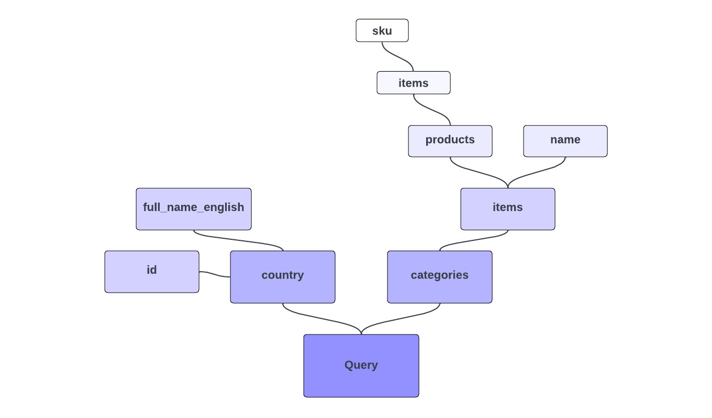

# consultas do GraphQL

Esta é a parte 2 da série para GraphQL e Adobe Commerce. Neste tutorial e vídeo, saiba mais sobre consultas do GraphQL e como executá-las no Adobe Commerce.

>[!VIDEO](https://video.tv.adobe.com/v/3450063?learn=on&captions=por_br)

## Vídeos e tutoriais relacionados ao GraphQL nesta série

* [Parte 1 GraphQL - Introdução](../graphql-rest/intro-graphql.md)
* [Parte 3 GraphQL - Mutações](../graphql-rest/graphql-mutations.md)
* [GraphQL Parte 4 - Esquema](../graphql-rest/graphql-schema.md)

## Exemplo de sintaxe do GraphQL

Vamos mergulhar diretamente na sintaxe de consulta do GraphQL com um exemplo completo. (Lembre-se, você pode tentar isso sozinho em https://venia.magento.com/graphql.)

Observe a seguinte consulta do GraphQL, que é dividida em partes:

```graphql
{
    country (
        id: "US"
    ) {
        id
        full_name_english
    }

    categories(
        filters: {
            name: {
                match: "Tops"
            }
        }
    ) {
        items {
            name
            products(
                pageSize: 10,
                currentPage: 2
            ) {
                items {
                    sku
                }
            }
        }
    }
}
```

Uma resposta plausível de um servidor do GraphQL para a consulta acima pode ser:

```json
{
  "data": {
    "country": {
      "id": "US",
      "full_name_english": "United States"
    },
    "categories": {
      "items": [
        {
          "name": "Tops",
          "products": {
            "items": [
              {
                "sku": "VSW06"
              },
              {
                "sku": "VT06"
              },
              {
                "sku": "VSW07"
              },
              {
                "sku": "VT07"
              },
              {
                "sku": "VSW08"
              },
              {
                "sku": "VT08"
              },
              {
                "sku": "VSW09"
              },
              {
                "sku": "VT09"
              },
              {
                "sku": "VSW10"
              },
              {
                "sku": "VT10"
              }
            ]
          }
        }
      ]
    }
  }
}
```

O exemplo acima depende do esquema GraphQL pronto para uso do Adobe Commerce, definido no servidor. Nesta solicitação, você
consulte vários tipos de dados de uma só vez. A consulta expressa exatamente os campos desejados e os dados retornados são formatados
de forma semelhante ao próprio query.

>[!NOTE]
>
>Os clientes do GraphQL ofuscam a forma da solicitação HTTP real que está sendo enviada, mas isso é fácil de descobrir. Se você estiver usando um cliente baseado em navegador, observe a guia [!UICONTROL Network] quando uma consulta for enviada. Você pode ver que a solicitação contém um corpo bruto que consiste na &quot;consulta: `{string}`&quot;, onde `{string}` é simplesmente a cadeia de caracteres bruta de toda a sua consulta. Se a solicitação estiver sendo enviada como uma GET, a consulta pode ser codificada no parâmetro da sequência de consulta &quot;consulta&quot; em vez disso. Ao contrário do REST, o tipo de solicitação HTTP não importa, somente o conteúdo da query.


## Consultando o que você deseja

`country` e `categories` no exemplo representam duas &quot;consultas&quot; diferentes para dois tipos diferentes de dados. Ao contrário de um paradigma de API tradicional, como REST, que definiria endpoints separados e explícitos para cada tipo de dados. O GraphQL oferece a flexibilidade de consultar um único endpoint com uma expressão que pode buscar muitos tipos de dados de uma só vez.

Da mesma forma, a consulta especifica exatamente os campos desejados para `country` (`id` e `full_name_english`) e `categories` (`items`, que tem uma subseleção de campos), e os dados que você recebe de volta espelham essa especificação de campo. Provavelmente, há muito mais campos disponíveis para esses tipos de dados, mas você retorna somente o que solicitou.


>[!NOTE]
>
>Você pode notar que o valor de retorno para `items` é na verdade uma _matriz_ de valores, mas você está selecionando subcampos diretamente para ele. Quando um tipo de campo é uma lista, o GraphQL entende implicitamente as subseleções a serem aplicadas a cada item na lista.

## Argumentos

Embora os campos que você deseja retornar sejam especificados dentro das chaves de cada tipo, os argumentos nomeados e valores para eles são especificados entre parênteses após o nome do tipo. Os argumentos geralmente são opcionais e geralmente afetam a maneira como os resultados da consulta são filtrados, formatados ou transformados.

Você está passando um argumento `id` para `country`, especificando o país específico a ser consultado, e um argumento `filters` para `categories`.

## Campos totalmente para baixo

Embora você possa pensar em `country` e `categories` como consultas ou entidades separadas, a árvore inteira expressa em sua consulta na verdade não consiste em nada além de campos. A expressão de `products` não é sintaticamente diferente daquela de `categories`. Ambos são campos, e não há diferença entre sua construção.

Qualquer gráfico de dados do GraphQL tem um único tipo &quot;raiz&quot; (normalmente referenciado como `Query`) para iniciar a árvore, e os tipos geralmente considerados como entidades são atribuídos a campos nessa raiz. A consulta de exemplo está na verdade fazendo uma consulta genérica para o tipo de raiz e selecionando os campos `country` e `categories`. Em seguida, seleciona subcampos desses campos e assim por diante, possivelmente com vários níveis de profundidade. Sempre que o tipo de retorno de um campo for um tipo complexo (por exemplo, um com seus próprios campos, em vez de um tipo escalar), continue para selecionar os campos desejados.

Esse conceito de campos aninhados também é o motivo pelo qual você pode passar argumentos para `products` (`pageSize` e `currentPage`) da mesma forma que fez para o campo `categories` de nível superior.



## Variáveis

Vamos tentar uma consulta diferente:

```graphql
query getProducts(
    $search: String
) {
    products(
        search: $search
    ) {
        items {
            ...productDetails
            related_products {
                ...productDetails
            }
        }
    }
}

fragment productDetails on ProductInterface {
    sku
    name
}
```

A primeira coisa a ser observada é a adição da palavra-chave `query` antes da chave de abertura da consulta, juntamente com um nome de operação (`getProducts`). Este nome de operação é arbitrário; ele não corresponde a nada no esquema do servidor. Essa sintaxe foi adicionada para oferecer suporte à introdução de variáveis.

Na query anterior, você codificava os valores dos argumentos dos seus campos diretamente, como sequências de caracteres ou números inteiros. A especificação do GraphQL, no entanto, tem suporte de primeira classe para separar a entrada do usuário da consulta principal usando variáveis.

Na nova consulta, você está usando parênteses antes da chave de abertura da consulta inteira para definir uma variável `$search` (as variáveis sempre usam a sintaxe de prefixo do cifrão). É esta variável que está sendo fornecida para o argumento `search` para `products`.

Quando uma consulta contém variáveis, espera-se que a solicitação do GraphQL inclua um dicionário de valores codificado em JSON separado junto com a própria consulta. Para a consulta acima, você pode enviar o seguinte JSON de valores de variável, além do corpo da consulta:

```json
{
    "search": "VT01"
}
```

>[!NOTE]
>
>Se você estiver testando essas consultas no site de exemplo Venia, em vez de em sua própria instância do Adobe Commerce, os resultados retornados provavelmente estarão vazios para `related_products`.

Em qualquer cliente com reconhecimento de GraphQL que você esteja usando para testes (como Altair e GraphiQL), a interface do usuário permite inserir as variáveis JSON separadamente da consulta.

Assim como você viu que a solicitação HTTP real para uma consulta GraphQL contém &quot;query: `{string}`&quot; no corpo, qualquer solicitação contendo um dicionário de variáveis simplesmente inclui uma &quot;variáveis: `{json}`&quot; adicional no mesmo corpo, onde `{json}` é a cadeia de caracteres JSON com os valores de variável.

A nova consulta também usa um _fragmento_ (`productDetails`) para reutilizar a mesma seleção de campo em vários lugares. [Leia mais sobre fragmentos](https://graphql.org/learn/queries/#fragments){target="_blank"} na documentação do GraphQL.

{{$include /help/_includes/graphql-rest-related-links.md}}
