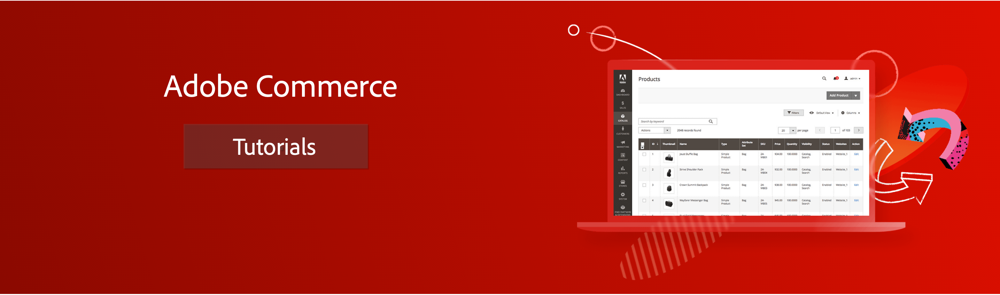

# [!DNL Commerce] Vídeos e tutoriais

Bem-vindo ao [!DNL Commerce] coleção de vídeos e tutoriais. Uso desses recursos, juntamente com o [documentação](https://experienceleague.adobe.com/docs/commerce.html), forneça um melhor entendimento sobre como usar [!DNL Commerce] para dar suporte à sua empresa de comércio eletrônico.

- Explore o conteúdo por tópico e subtópico na navegação à esquerda
- Use o campo de pesquisa na parte superior da página se você souber o que está procurando

Esses recursos básicos incluem séries de vídeos que fornecem uma exibição de alto nível de tópicos e vídeos individuais que direcionam tarefas e processos específicos. A coleção foi criada para fornecer conteúdo útil para desenvolvedores de backend, desenvolvedores de front-end, administradores de sistema, comerciantes e outras funções em sua organização.

Série básica de vídeos de nível básico para [!DNL Commerce] incluem:

- [Adobe Commerce na infraestrutura de nuvem](./cloud/1-overview.md) O é uma visão geral abrangente das principais tecnologias, estrutura do projeto, fases de implantação e configurações do Adobe Commerce na infraestrutura em nuvem.
- [[!DNL Commerce] para desenvolvedores](./developer/backend-1-1-overview.md) O é uma visão geral da plataforma para desenvolvedores de back-end.
- [[!DNL Commerce] para usuários empresariais](./merchant/introduction/1-1-menus.md) ajuda qualquer pessoa a conhecer a variável [!DNL Admin] lado de [!DNL Commerce].
- [[!DNL Business Intelligence]](./merchant/business-intelligence/1-overview.md) O é uma introdução de alto nível sobre como você pode gerar melhores insights e resultados de negócios por meio da agregação, análise e visualização de dados.

## Série de desenvolvedores adicionais

- [Progressive Web Apps (PWA) para desenvolvedores (série de vídeos)](./pwa/introduction/1-overview.md) Saiba mais sobre o PWA (Progressive Web Application) e por que o PWA Studio é o &#x200B; futuro. Esta série é uma ótima introdução para desenvolvedores e gerentes de projeto começarem com um projeto do PWA para [!DNL Commerce].

- [Visão geral do Page Builder para desenvolvedores (série de vídeo)](./developer/page-builder/1-intro-case-studies.md) Saiba mais sobre como o Page Builder funciona e como personalizar o Page Builder para design e gerenciamento avançados de conteúdo.

<!--
- **[Security planning for [!DNL Commerce] (video series)](./security/summit-security/1-summit-security.md)**
     
    *How the e-commerce threat landscape is changing. The importance of security for the customer running an e-commerce application and specific processes and practices for securing Magento*
-->

## Recursos adicionais

- [Documentação do usuário](https://docs.magento.com/)
- [Documentação do desenvolvedor](https://devdocs.magento.com/)
- [Documentação do PWA Studio](https://developer.adobe.com/commerce/pwa-studio/)
- [Serviços de aprendizado digital do Adobe - Catálogo de curso do Adobe Commerce](https://learning.adobe.com/catalog.html?solution=Adobe%20Commerce)
